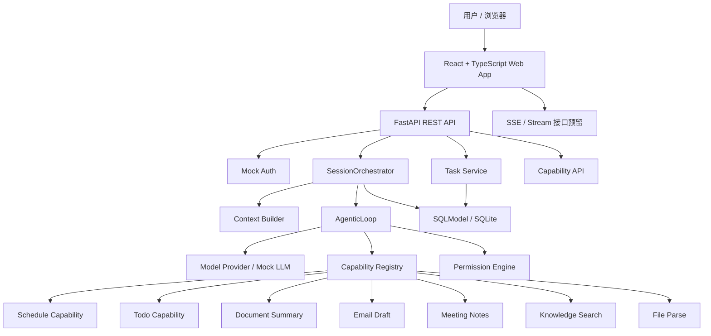
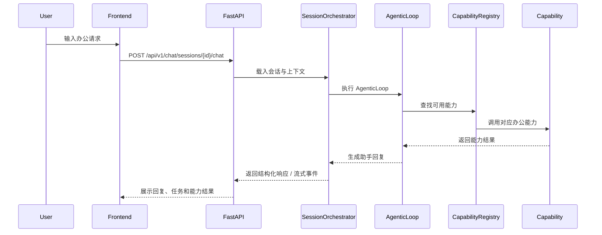

# WorkClaw

> 面向知识工作者的 AI 办公助手 Web 应用。  
> 目标不是替代 IDE 里的 Coding Agent，而是把「日程、待办、文档、邮件、会议、知识库」这些日常办公任务，统一到一个可扩展的 AI 工作台里。

[](#技术栈)
[](#技术栈)
[](#当前状态)

## 项目简介

WorkClaw 是一个前后端分离的 AI 办公助手项目，后端使用 Python + FastAPI，前端使用 React + TypeScript + Vite。

它借鉴了 Easy Agent / Claude Code 一类 Agent 系统的架构思想，但做了办公场景适配：

- Easy Agent 面向代码与终端，WorkClaw 面向办公与 Web。
- Easy Agent 的 Tool Registry 被抽象为 WorkClaw 的 Capability Registry。
- Easy Agent 的 QueryEngine / AgenticLoop 被转化为 SessionOrchestrator / AgenticLoop。
- Easy Agent 的权限模型被转化为更适合办公系统的 `strict` / `moderate` / `trusted` 模式。
- WorkClaw 不支持 CLI，不做 Shell 执行，不做代码修改，核心入口是浏览器。

当前版本是 MVP 雏形，重点是验证架构、交互形态和模块边界。第三方办公系统集成目前使用 mock / stub，不包含真实账号密钥。

## 核心能力

WorkClaw 当前已经包含以下办公助手能力雏形：

| 能力 | Capability ID | 当前状态 | 说明 |
|---|---|---|---|
| 日程管理 | `schedule` | Mock | 创建、查看、调整日程的能力雏形 |
| 待办管理 | `todo` | Mock | 创建、完成、整理待办事项 |
| 文档摘要 | `doc_summary` | Mock | 对文档内容生成结构化摘要 |
| 邮件草稿 | `email_draft` | Mock | 根据上下文生成邮件草稿 |
| 会议纪要 | `meeting_notes` | Mock | 整理会议记录，提取结论和行动项 |
| 知识库检索 | `knowledge_search` | Mock | 面向公司资料、项目文档的问答检索 |
| 文件解析 | `file_parse` | Mock | 文件上传与解析流程的预留能力 |

## 产品形态

WorkClaw 的前端被设计成一个 AI Office Cockpit：

- **Dashboard**：今日工作概览、快捷动作、最近会话、任务状态和能力入口。
- **Assistant**：对话式办公助手，支持发送消息、展示助手回复和技能调用卡片。
- **Tasks**：任务列表、状态标签、优先级和行动项管理。
- **Sessions**：历史会话列表和会话上下文入口。
- **Skills**：技能管理面板，让用户可以开启/关闭 AI 助手可以使用的技能。
- **Capability Panel**：右侧面板显示当前可用能力列表（桌面端）。

前端已经做了响应式布局：

- 桌面端：侧边导航 + 中央工作区 + 卡片化信息区。
- 移动端：纵向卡片、紧凑导航和适配手机宽度的内容布局。

## 架构图



## 运行流程



## 技术栈

### 后端

- Python 3.9+（建议 Python 3.11+）
- FastAPI
- Pydantic v2
- SQLModel / SQLAlchemy
- SQLite（可迁移到 PostgreSQL）
- sse-starlette（流式接口预留）
- pytest

### 前端

- React 18
- TypeScript
- Vite 4
- React Router
- Axios
- CSS Variables + 响应式 CSS

> 注意：当前项目锁定 Vite 4，是为了兼容当前本地运行环境。不要随意升级到 Vite 5 / Vite 8，否则在某些 Electron Node 环境下可能遇到 Rollup / Rolldown 原生 binding 签名问题。

## 项目结构

```text
workclaw/
├── README.md
├── .gitignore
├── docs/
│   ├── PROJECT_PLAN.md
│   └── SKILL_PANEL_PLAN.md
├── backend/
│   ├── pyproject.toml
│   ├── .env.example
│   ├── app/
│   │   ├── main.py
│   │   ├── api/v1/
│   │   ├── capabilities/
│   │   ├── config/
│   │   ├── core/
│   │   ├── models/
│   │   └── services/
│   └── tests/
├── frontend/
│   ├── package.json
│   ├── package-lock.json
│   ├── vite.config.ts
│   ├── index.html
│   └── src/
│       ├── api/
│       ├── components/
│       ├── pages/
│       ├── styles/
│       └── types/
└── scripts/
    └── keep-workclaw-tunnel.sh
```

## 快速开始

### 1. 克隆项目

```bash
git clone git@github.com:wp931120/workclaw.git
cd workclaw
```

### 2. 启动后端

```bash
cd backend
pip install -e ".[dev]"
python3 -m uvicorn app.main:app --host 0.0.0.0 --port 8010
```

后端默认访问地址：

```text
http://localhost:8010
```

健康检查：

```text
http://localhost:8010/api/v1/health
```

API 文档：

```text
http://localhost:8010/docs
```

### 3. 启动前端

```bash
cd frontend
npm install
npm run dev -- --host 0.0.0.0 --port 3010
```

前端访问地址：

```text
http://localhost:3010
```

当前 `vite.config.ts` 中已经配置代理：

```text
/api -> http://localhost:8010
```

因此前端可以直接通过 `/api/v1/...` 访问后端。

## API 概览

### 健康检查

```http
GET /api/v1/health
```

### 认证

```http
POST /api/v1/auth/token
```

当前为本地开发 mock auth，后续可扩展 OAuth / SSO。

### Chat SSE 事件

Chat API (`POST /api/v1/chat/sessions/{session_id}/chat`) 返回 SSE 流式事件：

| 事件类型 | 说明 |
|----------|------|
| `text_delta` | 流式文本片段 |
| `capability_call` | AI 开始调用某个能力（技能调用开始） |
| `capability_result` | 能力执行结果返回 |
| `usage` | Token 使用量 |
| `done` | 对话完成 |
| `error` | 错误发生 |

`capability_call` 事件数据示例：

```json
{
  "name": "schedule",
  "title": "日程管理",
  "input": { "action": "list" },
  "call_id": "uuid",
  "timestamp": "2024-01-01T12:00:00Z"
}
```

`capability_result` 事件数据示例：

```json
{
  "name": "schedule",
  "result": {
    "success": true,
    "content": "今日日程:\n- 10:00 团队会议"
  },
  "duration_ms": 123,
  "call_id": "uuid"
}
```

前端会根据这些事件在聊天界面显示工具调用卡片。

### Chat / Sessions

```http
POST   /api/v1/chat/sessions
GET    /api/v1/chat/sessions
GET    /api/v1/chat/sessions/{session_id}
DELETE /api/v1/chat/sessions/{session_id}
GET    /api/v1/chat/sessions/{session_id}/messages
POST   /api/v1/chat/sessions/{session_id}/chat
```

### Capabilities

```http
GET /api/v1/capabilities
```

返回当前注册的办公能力列表（与 Skills API 配合使用）。

### Skills

```http
GET    /api/v1/skills
GET    /api/v1/skills/{skill_id}
PATCH  /api/v1/skills/{skill_id}
POST   /api/v1/skills/{skill_id}/toggle
```

Skills API 允许用户控制哪些能力对 AI 助手可用：

- `GET /api/v1/skills` - 返回所有 skills（含 enabled 状态、标题、描述、分类）
- `PATCH /api/v1/skills/{skill_id}` - 更新 skill（主要是 enabled 状态）
- `POST /api/v1/skills/{skill_id}/toggle` - 快捷切换启用状态

响应格式示例：

```json
{
  "skills": [
    {
      "id": "uuid",
      "name": "schedule",
      "title": "日程管理",
      "description": "Manage calendar events...",
      "category": "schedule",
      "enabled": true,
      "read_only": false,
      "is_dangerous": false,
      "icon": "calendar"
    }
  ],
  "count": 7
}
```

关闭某个 skill 后，AI 助手不会再收到该能力的 tool schema，也无法调用它。

### Tasks

```http
GET    /api/v1/tasks/tasks
POST   /api/v1/tasks/tasks
GET    /api/v1/tasks/tasks/{task_id}
PATCH  /api/v1/tasks/tasks/{task_id}
DELETE /api/v1/tasks/tasks/{task_id}
```

## 配置说明

后端配置通过环境变量读取，可参考：

```text
backend/.env.example
```

常用变量：

| 变量 | 默认值 | 说明 |
|---|---|---|
| `WORKCLAW_DEBUG` | `true` | 调试模式 |
| `WORKCLAW_DATABASE_URL` | `sqlite+aiosqlite:///./data/workclaw.db` | 数据库连接 |
| `WORKCLAW_DEFAULT_MODEL_PROFILE` | `anthropic` | 默认模型 Profile |
| `WORKCLAW_DEFAULT_PERMISSION_MODE` | `moderate` | 默认权限模式 |
| `WORKCLAW_ANTHROPIC_API_KEY` | 空 | 预留 Anthropic API Key |
| `WORKCLAW_OPENAI_API_KEY` | 空 | 预留 OpenAI API Key |

当前 MVP 默认使用 mock / stub 能力，不需要真实第三方密钥。

## 开发验证

### 后端测试

```bash
cd backend
pytest -v
```

### 前端类型检查

```bash
cd frontend
npx tsc --noEmit
```

### 前端构建

```bash
cd frontend
npm run build
```

如果在 Electron Node 环境中遇到 Rollup / Rolldown native binding 报错，请使用系统 Node.js 或保持当前 Vite 4 版本。

## 设计原则

### 1. Web 优先，而不是 CLI 优先

WorkClaw 面向办公用户，入口是浏览器。它不提供 CLI，也不执行 Shell 命令。

### 2. Capability 是一等公民

每个办公能力都通过统一接口注册，后续可以像插件一样扩展。

### 3. 会话编排和能力调用分离

SessionOrchestrator 负责会话、上下文和流转；Capability 只负责具体办公动作。

### 4. Mock 先行，真实集成后置

MVP 阶段先验证产品体验和架构边界，日历、邮件、知识库、文档系统等真实集成在后续迭代中接入。

### 5. 默认安全

当前不会读取真实办公账号，不会发送真实邮件，不会访问真实第三方服务。所有外部集成都应显式配置密钥和权限。

## 当前状态

当前版本：`0.1.0`。

### 功能完成度

| 功能 | 状态 | 说明 |
|------|------|------|
| 后端 FastAPI 应用 | ✅ 完成 | 入口、生命周期、CORS |
| 认证 API | ✅ 完成 | Mock 本地开发 Token 认证 |
| Session CRUD | ✅ 完成 | 持久化到 SQLite |
| Message 持久化 | ✅ 完成 | 与 Session 关联存储 |
| Chat SSE 流式响应 | ✅ 完成 | 真实 LLM 调用（glm-5.1），无 Token 时回退 Mock |
| Tasks CRUD | ✅ 完成 | 已迁移到数据库持久化 |
| Capabilities 列表 | ✅ 完成 | 返回 7 个能力，含 schema |
| Skills 管理面板 | ✅ 完成 | 技能开启/关闭，数据持久化 |
| Skill 执行控制 | ✅ 完成 | 关闭 skill 后 LLM 不会调用 |
| 工具调用可视化 | ✅ 完成 | Chat 中显示技能调用卡片 |
| Capability 执行 | ⚠️ Stub | Mock 实现，可扩展真实集成 |
| Dashboard | ✅ 完成 | 数据优雅降级，单 API 失败不白屏 |
| Assistant 页面 | ✅ 完成 | SSE 流式展示、错误提示 |
| Tasks 页面 | ✅ 完成 | 状态筛选、创建、删除、状态切换 |
| Sessions 页面 | ✅ 完��� | 列表、创建、删除、选择 |
| 测试覆盖 | ✅ 完成 | Health、Auth、Sessions、Tasks、Chat、Capabilities |
| 前端类型检查 | ✅ 完成 | TypeScript 严格模式 |

### 真实实现 vs Mock

- **真实实现**：Session/Message 持久化（SQLite）、Chat SSE 流式响应、Tasks CRUD、Auth Token
- **Mock/Stub**：Capabilities 执行（schedule、todo、doc_summary 等返回预设响应）
- **外部依赖**：glm-5.1 模型（通过 cucloud gateway），无 API Token 时自动回退 Mock

### 已完成

- FastAPI 应用入口。
- CORS 与基础配置层。
- Mock Auth（本地开发 Token）。
- Chat Session API（SSE 流式）。
- Capability Registry。
- 7 个办公能力（stub 实现）。
- Task API（数据库持久化）。
- React + TypeScript 前端。
- Dashboard、Assistant、Tasks、Sessions 页面。
- 响应式前端布局。
- 核心 API 测试覆盖。
- 本地开发与公网临时预览脚本。

### 仍待完善

- 日历、邮件、知识库真实集成（需 OAuth 账号）。
- 文档上传与解析（需文件存储）。
- 企业认证与权限模型。
- PostgreSQL 生产部署。
- 更完整的端到端测试。

## 路线图

### Iteration 1：核心对话闭环

- 接入真实 LLM。
- 完善 AgenticLoop。
- 支持能力调用结果回填。
- 引入更完整的上下文管理。

### Iteration 2：办公能力落地

- 日程系统集成。
- 邮件草稿与发送确认流。
- 文档上传、解析与摘要。
- 会议纪要与行动项提取。

### Iteration 3：知识库与工作流

- 知识库检索。
- 任务拆解与状态跟踪。
- 通知中心。
- 多步骤办公工作流。

### Iteration 4：生产化

- OAuth / SSO。
- PostgreSQL。
- 部署配置。
- 权限审计。
- 前端体验打磨。

## 临时公网预览

开发阶段可以使用 `localtunnel` 或其他隧道工具临时暴露前端：

```bash
cd frontend
npx --yes localtunnel --port 3010 --subdomain workclaw-wp931120
```

也可以使用脚本做简单保活：

```bash
./scripts/keep-workclaw-tunnel.sh
```

注意：临时隧道不是生产部署方案，地址可能不稳定。长期预览建议使用 Cloudflare Tunnel、ngrok 固定域名或正式部署平台。

## 许可证

MIT License
